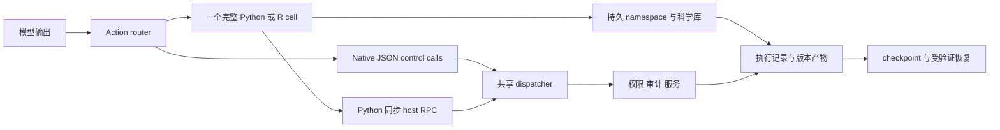

# OpenAI4S: Code as Action, Science as Sessions

## 一句话结论

OpenAI4S 把 persistent Python/R kernel、受审计的服务调用和研究会话记录组合成科学 Agent harness；在作者的仓库级评测中，更可靠地交付长程科学工作流的产物、报告与轨迹，但实验没有隔离架构贡献，也没有证明跨机器科学复现或普遍更准确的科学预测。

**我的判断**：值得读的是“计算状态怎样连接到可检查的研究记录”。对 7.83 分和低尾优势应保留判断：v1 的图 5 与正文存在数字、样本范围冲突，公开 evaluator 的多个领域指标仍使用结构性 proxy。

> 阅读范围：arXiv **2609.15096v1**，2026-09-14，PDF 共 20 页，包含补充实现说明。下文页码为 PDF 页序。已阅读全文、核对图表、静态检查作者指定实现 commit 的恢复代码和公开 judge 包；**没有执行科学实验或复现跑分**。论文标题中的 OpenAI4S 是项目名，作者机构见 p.1。

## 三分钟筛选

- **问题**：科学研究反复使用大数据、模型、模拟轨迹；进程态丢失、产物不可归因、代码没有真正执行、报告没有落盘都会妨碍续跑和审查。
- **新意**：已有 CodeAct、TaskWeaver 和 programmatic tool calling 提供代码执行、持久状态或程序内工具组合；本文新意主要是将它们与 session-level ledger、artifact/environment 版本、恢复和完成契约整合，而非首创 code-as-action（§2，pp.3–4；图 3，p.6）。
- **核心证据**：六任务宏平均 7.83；15 个 MD/binder 场景均交付最终产物与报告，对照为 0/15、3/15、8/15；但这些是完整系统比较和仓库交付指标（表 3、图 6C，pp.12、14）。
- **与我的关系**：连接 Agent infrastructure、可追溯执行、持久状态和故障恢复；适合与 Logos、EvoUndo、ERPBench 一起理解“记录—执行—验证”的边界。
- **决定**：完成精读；后续优先做无 GPU 的会话恢复和 evaluator 审计，再决定是否重跑科学任务。

## 问题设定

- **输入**：研究目标、场景规范、数据/结构/序列、计算预算、科学方法和禁止访问的评估信息。
- **输出**：研究 codebase，包括源代码、中间与最终产物、分析报告和执行记录；目标同时覆盖结果、流程与可复现性（§4.2，pp.10–11）。
- **瓶颈**：科学对象通常大且昂贵；以逐次独立动作组织工作易产生重复加载、上下文膨胀或不完整交付。仅有 notebook 或 shell 记录仍缺少产物版本、环境身份和受验证的恢复。
- **关键假设**：科学依赖与后端可用；记录和插桩覆盖了所需输入；可恢复 cell 能安全重放；任务规范和 evaluator 能识别有效科学流程。本文明确承认这些前提并非全覆盖。
- **范围**：计算研究流程，包含预测、数值分析与有限预算工作流；不等同于湿实验成功或自治科学发现能力。

## 核心贡献

1. **双通道执行**：native JSON control calls 管编排、权限和服务；完整 Python/R cell 管科学计算，Python 可在 cell 内同步调用 host（§3.1–3.2，图 2，pp.4–5）。
2. **research session 持久化**：把 objective、turn/cell、执行结果、版本产物、kernel generation、环境和 workspace checkpoint 连接到可导出会话（§3.3，pp.5–7）。
3. **有边界的恢复和完成检查**：只重放符合条件的 cell，检查符号、产物 hash 和环境；按 completion mode 检查交付证据。检查完成不自动验证科学结论。
4. **仓库级评估**：accuracy/workflow/reproducibility 分解成 binary criteria，确定性判据优先、语义 judge 只能进一步否决，并对重大科学失败封顶（§4.2，pp.10–12）。

## 方法

### 直觉

把 Agent 想成一个有实验记录系统的计算工作台：模型决定下一步，kernel 保存正在使用的大对象，host 管资源与服务，ledger 保存执行事实，artifact store 保存实际字节。后续研究者能追问某个数值是哪段代码、哪个环境、哪份输入产生的，并在可恢复范围内继续工作。

例如先清洗数据、拟合模型，再做误差分析。第二个 cell 能直接引用第一个 cell 的模型对象；但若 kernel 重启，模型对象不会凭空回来，需要已保存文件或可验证重放。这种区别是理解论文的关键（§3.3，pp.5–6）。

### 形式化描述

本文没有新学习目标或训练算法。可用以下**个人抽象**帮助理解状态，不是作者公式：

\[
S_t=(K_t,W_t,L_t,A_t,E_t,C_t)
\]

其中 \(K\) 是活着的 kernel namespace，\(W\) 是 workspace 文件，\(L\) 是 ledger/execution history，\(A\) 是版本产物，\(E\) 是执行环境记录，\(C\) 是 checkpoint。worker 重启后 \(K\) 消失；其余部分是否保存、能否重建 \(K\)，需要分别验证。

同一模型响应中 native calls 优先；否则选一个完整 cell。独立只读 control calls 可有限并行，变更或未知调用成为屏障。Python cell 的 RPC 是阻塞式 `host_call → host_ack → host_response`；`host.llm` 批次可在 host 内并行，不是同一 worker 同时进行多个 RPC（§3.2，pp.4–5；补充 S1，p.18）。

### 关键模块与训练流程

| 模块 | 具体作用 | 必须保留的边界 | 定位 |
| --- | --- | --- | --- |
| Python/R kernels | 懒启动、跨 foreground cell 保留对象 | 两语言 namespace 独立，通过文件交换；R 无 host RPC；worker 停止、重启或释放后内存态丢失 | §3.2，p.4；S1，p.18 |
| Background worker | 提交、轮询、打断长任务 | 每个后台任务是独立 Python worker，不自动继承前台对象 | §3.2，p.4；S1，p.18 |
| Action Ledger + execution log | 记录 action group、cell source/hash、结果、模型使用量及执行状态 | 平常 append-only，删除 session 仍可删除记录；不是不可篡改审计证明 | §3.3，p.6；S4，p.19 |
| Artifact/environment 版本 | SHA-256 字节快照、producing cell、实际 worker 环境身份 | 保存 manifest 不等于新机器能安装同一环境 | §3.3，pp.5–6 |
| Dependencies/lineage | AST/R lexer 推断符号依赖；受支持操作传播 provenance | 静态依赖非实际执行轨迹，输入插桩非全覆盖；附加 live-Notebook lineage 默认关闭 | §3.3，p.6；S2–S3，pp.18–19 |
| Checkpoint/branch/revert | 保存 workspace 与部分 session 元数据，提供分支和冲突预览 | 自动 checkpoint 是 best-effort，不保证每个持久化 cell 都有恢复点 | §3.3，p.6 |
| Verified recovery | 新建候选 worker、hydrate 文件、重放适用 cell、验证后激活 | 不序列化任意 Python/R 对象；不安全或不确定步骤被排除，覆盖不足报告 partial/failed | §3.3，p.6；S4，p.19 |
| Completion contract | engine `finalize_response` 或 Python `host.submit_output` 结束 run | 常规检查较弱；更强 source/hash/test evidence 检查仅在明确选择的 code-output modes 生效 | §3.3，p.7 |
| Skills | 43 curated + 561 bioSkills = 604，按需检索代码 recipe/helper | recipe、model weights、包和硬件仍需逐项满足；Skill load hash 不是独立可信执行证明 | §3.5，p.8 |

**静态实现核对**：在论文锁定 commit `4e96b251a88197ec070b3e088a720a1a55e817f3`，`server/recovery_recipe.py::_cell_recovery_reasons` 检查成功状态、源码 hash、manifest、未知状态变更、文件写入、未解决符号与重放安全。`kernel/recovery.py::KernelRecoveryOrchestrator` 的候选恢复流程先验证，再 `_publish`；出现 issues 会关闭候选并返回 `partial`。这支持实现描述，**不构成实际恢复成功率验证**。

### 计算与数据成本

无需模型训练；成本来自模型推理、检索、科学库/权重准备、仿真或结构设计，以及保存轨迹和产物。核心 engine/transport/daemon 使用 Python 标准库，科学依赖隔离在 kernel 环境，session 用 SQLite（§3.6，p.8）。

**实验披露缺口**：OpenAI4S 使用 `doubao-pro`，对照使用 Claude Code + Kimi-K3 / GLM-5.2 / Opus-4.8（§5，p.14）。论文没有给出足以匹配实验的精确 provider/model 版本、benchmark-run commit、全量 prompts/feature flags、每场景 wall time/token/金额/GPU 预算、重复运行与 seed 配置。附录的 2026-09-08 实现 commit **明确不是实验版本**（S1 前言，p.18）。因此不能从“更便宜模型”推出整体性价比结论。

资源记录还要避免误读：cell wall/CPU time 有记录，RSS 在语言和平台间含义不同；R/Linux 是进程生命周期高水位，R/macOS 缺值，不能直接横比 per-cell memory（S2，p.18）。

## 实验与证据

| 作者主张 | 对应证据 | 定位 | 我的判断 |
| --- | --- | --- | --- |
| 完整系统的仓库级质量更高 | 六任务宏平均 7.83，GLM 6.36、Opus 6.12、Kimi 5.79；OpenAI4S 最弱任务 7.01 | 表 3，§4.3，p.12 | 支持当前 evaluator 下的整套系统优势；未隔离 runtime 贡献 |
| 长程蛋白任务交付更稳定 | MD + binder 15/15 同时有 final artifact 与 report；Kimi 0/15、GLM 3/15、Opus 8/15 | 图 6C，p.14 | 最清楚的过程证据；完成交付可包括科学边界明确的 partial computation |
| 不只是少数高分场景拉均值 | 正文称 31 配对场景低于 5 分比例为 6.5%，对照 61.3% / 45.2% / 51.6% | §4.4，p.12 | 图 5 图内范围和数值冲突，当前只按正文报告，不作为独立复核结论 |
| 产物可检查、数字可追溯 | protonation case 抽样报告数字 95% 可追到机器可读证据 | §4.4，p.13 | 单场景、抽样细节未充分披露；数值有出处不代表科学解释正确 |
| 交付契约会影响分数 | catalyst scenario-5 已执行数值筛选，但报告/图/依赖打包不全，得 4.4，三对照各 4.9 | 图 7，p.15 | 反例提醒总分高度包含交付质量；科学执行与打包应分开报告 |
| 可验证恢复有具体实现 | 补充描述与 pinned recovery source 的 validate-before-publish 路径一致 | §3.3；S4；源码 | 支持机制存在，不支持跨机器恢复率或任意对象恢复 |

### 数据、基线与指标

- **数据集**：36 scenarios：Retrosynthesis 6、Protein Binder Design 6、MD 9、Protein Mutation 5、Catalyst SAR 5、Mineral Spectra 5。总分包含六任务；配对场景分析正文仅含五任务、31 场景，排除 Protein Mutation（§4.1，pp.8–10）。表 2 行却把 mutation 标为 included、总计 36，见下文一致性审计。
- **执行 regime**：mutation 有 withheld experimental measurements；spectra 是可执行数值逆问题；retro 侧重 frozen outputs 的协议处理；MD/binder/catalyst 的昂贵后端可能被预算限制或不可用。聚合分数不能视为统一物理/生化预测准确率（p.10）。
- **基线**：上述三模型使用 Claude Code；没有 matched-model 架构消融，也没有 TaskWeaver/Biomni 等专门科学 harness 的受控对比。GT 是人工设计 workflow + 最佳 coding model + 多轮 refinement 的参考，不是“人类真实科学正确率”（表 3 图注）。
- **指标**：三个维度在 [0,1]；总体 \(10(0.4 A+0.35 W+0.25 R)\)。各维度为适用 binary criteria 的加权通过率；多证据取 AND，确定性失败不能由 LLM 改成成功；重大失败通常封顶 2.0（式 1 与 §4.2，pp.11–12）。
- **稳定性**：正文称 leave-one-task-out 排名稳定，去掉整个 protein domain 后对 GLM 的差距仅约 0.04。无充分多次运行、置信区间、judge-human calibration 或 judge variance 报告。

### 表 3：结果重写与读法

| 任务 | OpenAI4S | Kimi-K3 | GLM-5.2 | Opus-4.8 | OpenAI4S 相对最佳对照 |
| --- | ---: | ---: | ---: | ---: | ---: |
| Retrosynthesis | 7.54 | 7.32 | 7.62 | 5.04 | −0.08 |
| Protein Binder Design | 8.46 | 3.12 | 3.44 | 7.58 | +0.88 |
| Molecular Dynamics | 8.57 | 3.81 | 5.62 | 4.89 | +2.95 |
| Protein Mutation | 7.96 | 8.11 | 7.19 | 7.37 | −0.15 |
| Catalyst SAR | 7.01 | 5.51 | 6.28 | 5.52 | +0.73 |
| Mineral Spectra | 7.45 | 6.84 | 7.97 | 6.35 | −0.52 |
| 六任务宏平均（论文报告） | **7.83** | 5.79 | 6.36 | 6.12 | +1.47 对 GLM |

**个人复算**：OpenAI4S 六个任务显示值的算术平均为 7.8317，与 7.83 一致；非 protein 三任务相对 GLM 差值平均为 \((-0.08+0.73-0.52)/3=0.0433\)。这支持“优势集中在蛋白长程工作流”，并提醒不能解释为所有科学领域普遍领先。

### v1 图文一致性审计

已对 PDF p.13 图 5 做视觉核对，冲突真实存在，不是 PDF 抽取错误。

| 项目 | 正文 / 图注 | 图内 / 其他表格 | 当前处理 |
| --- | --- | --- | --- |
| 宏平均 | 摘要、§4.3、表 3：7.83 | 图 5B：macro 8.20 | 使用可由表 3 复算的 7.83；不猜测 8.20 的来源 |
| 配对分析范围 | §4.1、§4.4、图 5 caption：31，排除 mutation | 图 5B/C/D：All 36；表 2 mutation included、Total 36 | 区分 six-task macro 与正文 31-case paired subset；缺原始矩阵，无法完全对账 |
| 对 Kimi 配对差与胜平负 | §4.4：+3.09，25/3/3 | 图 5C：+2.39，26/4/6 | 不混用 |
| 对 GLM 配对差与胜平负 | §4.4：+2.20，24/0/7 | 图 5C：+1.70，24/5/7 | 不混用 |
| 对 Opus 配对差与胜平负 | §4.4：+2.54，28/1/2 | 图 5C：+1.93，27/4/5 | 不混用 |

§4.2 p.12 还提到 155 system–scenario evaluations 与 36 paired scenarios；155 恰等于 31×5，**仅是算术观察，不证明作者实际采用了该矩阵**。冲突可能来自材料版本不同，但没有作者说明，不能断言原因，也不能据此认定数据造假。

原始视觉证据：![[assets/papers/2609.15096/OpenAI4S-v1-page13-figure5.png]]

### 公开 evaluator 的补充审计

来源是 [SciCodeBench-OpenAI4S 的 llm-judge.zip](https://huggingface.co/datasets/OzymandisLi/SciCodeBench-OpenAI4S/blob/1c16c8d08cd353f7b1432f398e35f1134b2ca39d/llm-judge.zip)，2026-09-29 下载并静态阅读，dataset revision 为 `1c16c8d08cd353f7b1432f398e35f1134b2ca39d`，ZIP SHA-256 为 `a7da8c4a4ed4c3502957e00930bc2ba6a9bcc86586cb279bb228bbf2fa95b983`。与论文实验使用的 judge 是否完全相同，未被确认。

1. **Accuracy 不是纯数值准确率。** A1 看最终文件与 JSON 解析；A2 用报告数字到产物的启发式匹配；A3/A4 名义上是主/次科学指标；A5 判断结论边界；A6 检查禁用数据。这些共同计入 accuracy，故不能将 accuracy block 翻译为 prediction accuracy。
2. **多个领域 A3/A4 仍是 proxy。** `scripts/static_assertions.py::check_A3_A4_proxy` 对 mineral 主要检查合法 composition JSON 与 correction-search 文件；对 catalyst 看相关字段、report/figure；对 retro 看 evaluation/status 和 candidate/score 结构；对 binder/MD 看 manifest 与 metric tables。函数返回 `proxy=True`，并不能验证真实 composition F1、interface quality 或轨迹 QC。
3. **Protein Mutation 是重要例外。** 该分支读取独立 pmbench 对隐藏 labels 的已有评估，返回 `proxy=False`，使用 contract/scorable、Spearman 或 panel improvement 等；不能概括成“全部任务只检查文件”。我未独立重跑 pmbench。
4. **Reproducibility 测的是部分条件。** `checklists/dimension-3-reproducibility.md` 的 R1 看是否存在依赖文件，R2 看非空 trajectory，R3 看 action 字段与中间文件，R4 由 LLM 判断说明是否足以重跑，R5 看续跑证据。没有洁净新机器重建并验证结果的强制实验。R2≥1 条记录也不能本身证明轨迹完整。
5. **确定性检查仍有漏检边界。** A6 已由原始字符串匹配改为 AST-based read detection，减少免责声明误报；这更好，但动态路径、别名、间接加载和运行时外部读取仍需独立观测。deterministic 不等于 sound/complete。
6. **judge 运行仍需补足。** `run_matrix.py` 不调用 LLM API，等待外部生成 `stage3_llm.json`；缺失时退回 `--no-llm` provisional score。固定 prompt/temperature=0 减少波动，但不能证明语义判断完全无偏或可重现。

**公开材料覆盖**：当日直接查询 Hugging Face tree API，根目录有 catalyst、mineral、mutation、retro 四个数据 ZIP 和 `llm-judge.zip`；没有找到独立 binder/MD 数据 ZIP。judge 包含六领域附录。网页缓存的文件列表与 API 不一致，本记录以 API 为准；尚未遍历四个数据包，不能排除其中嵌套了其他领域材料，也不能断言全部缺失。全量原始跨系统结果、实验配置与图表源数据未完成核验。

## 批判性阅读

### 证据支持的结论

- 为科学 Agent 显式保存结果、执行状态、报告和边界说明，能提高当前评测下的交付可靠性；MD/binder 的 15/15 交付是清楚的观察。
- 计算对象保留、持久文件/历史、受验证恢复、科学重跑是四个不同性质。把它们拆开，是本文最值得复用的设计。
- 即使真实计算完成，漏交报告/figure/dependency 仍可能造成整体失败；评价应同时列出 execution 与 delivery。
- source/hash/environment 的显式记录能帮助归因；缺失的记录应标缺失，而非用 daemon 环境或模型声明替代。

### 尚未被充分支持的结论

- **“persistent kernel 是分数提升的原因”**：无 matched model/prompt/Skills/compute 消融，模型与完整系统配置共同变化。
- **“code-as-action 必然优于 tool calling”**：TaskWeaver、programmatic tools 已能保留状态和组合调用；图 3 只是一个执行模式示例，作者也明确注明这一点。
- **“便宜模型已达到更强科学能力/更好整体性价比”**：科学指标与结构 proxy 混合，且成本未完整核算。
- **“高 reproducibility score = 他人能复现实验”**：当前 judge 主要检查结构和语义可理解性，没有充分跨机器执行验证。
- **“安全检查或 structured completion 证明结果正确”**：完成契约验证文件/来源等有限条件，不证明任意科学命题。

### 局限、风险与可能反证

- **评测契合系统设计**：trajectory/artifact/bounded claims 正是 OpenAI4S 的强项，评分奖励这些属性合理，但因果归因和外部有效性仍需第三方任务、科学 endpoints 与 matched comparison。
- **领域 proxy 与多重计分**：A1/A3 等可能因同一文件存在同时得分；总分增益可能部分来自交付的重复奖励。应另报纯领域指标及去掉结构 proxy 后的排名。
- **恢复范围有限**：best-effort checkpoint、静态依赖和有限 provenance 无法恢复未知对象、不可重放调用或任意外部状态；需要公开恢复覆盖率、拒绝率和失败检测结果。
- **安全配置不能读成统一强保证**：sandbox 默认 auto 可带 degraded 状态继续；host egress allowlist 默认关闭；biosecurity 只让 BLOCK 阻止执行，ESCALATE 当前为 advisory，screening call 失败可放行；独立 scientific review/repair 默认关闭（表 1，p.7；§3.4，pp.7–8；S3，p.19）。论文没有证明这些功能都在 benchmark 中启用。
- **可反证测试**：给所有系统同样的报告模板、manifest schema 和预算，保留/去掉 kernel、ledger、Skills；在洁净环境实际重跑科学端点。若分数差消失，应把优势归因到工作流约束或资源，而非特定执行架构。

## 与已有知识的连接

- **论文引用的前身**：CodeAct、TaskWeaver、Data Interpreter、smolagents、Jupyter；本文 §2 对已有持久执行与程序内调用的承认比较清楚。此处只按本文相关工作定位，未重新精读这些原文。
- **会话恢复对照**：[[notes/papers/2026/08/31/Logos- An Agent Harness on a Cross-Process Bus]] 把 transcript 放到进程外并用故障注入检验恢复；OpenAI4S 进一步面对科学 namespace、artifact/environment 与受限 replay。Logos 的 controlled fault evidence 不能自动迁移到 OpenAI4S。
- **变更恢复互补**：[[notes/papers/2026/08/31/EvoUndo- Recoverability-Constrained Self-Evolution for LLM Agent Harnesses]] 检查 mutation 的 witness/contract/undo；本文检查研究 session 的 replay/hydration。回到旧文件与撤销外部副作用不是同一件事。
- **运行时边界**：[[notes/papers/2026/08/31/A Programming Paradigm for Spatiotemporal Composability]] 区分可逆 acquisition 与不可逆 emission；本文的安全 replay 同样不能把已发生网络或物理副作用变成可撤销。
- **验证强度对照**：[[notes/papers/2026/09/18/ERPBench- A State-Grounded Evaluation Paradigm for Computer-Use Agents in Enterprise Software]] 强调真实持久状态证据；本文提醒 evaluator 也要从 code/artifact existence 进一步走到 executed scientific outcome。
- **跨论文综合**：已更新 [[notes/topics/结构化中间层与可验证执行]] 与 [[notes/topics/动态软件组合与可逆运行时]]，把审计、恢复、重跑和科学有效性分开。

## 复现计划

- **是否复现**：待定；本轮只完成阅读与源码静态核查。
- **最小验证目标**：用固定小数据拟合一个确定性回归对象并生成 figure/result；保存会话后 kill worker，验证安全 replay 能恢复需要的符号与 hash；加入不可重放/随机/外部服务 cell，验证诚实的 partial/failed。
- **所需资源**：本地 Python/kernel 环境、pinned code、固定数据；用录制或 mock model 隔离模型波动，无 GPU 即可测机制。开始执行前另建 `notes/reproductions/` 记录环境、版本、seed、命令和差异。
- **成功标准**：正常恢复产物一致；hash/environment 不匹配不得成功激活；不安全 cell 不重复外部副作用；记录 restoration coverage、false-success、恢复耗时。
- **下一阶段**：挑一个 mineral scenario，在同模型、同工具/Skills/预算下比较基础 harness、persistent kernel、ledger/artifact contract；同时报告实际 F1/误差、交付成功率、洁净重跑率和总成本。只改变一个模块时才讨论归因。

## 待追踪问题

- [ ] 作者能否提供与表 3 一致的全量结果矩阵、图 5 源数据，并解释 7.83/8.20 与 31/36 的差异？
- [ ] 实验 run commit、doubao-pro 精确版本、judge model/输出、prompts、feature flags 和各系统预算是什么？
- [ ] 替换 A3/A4 proxy 为真实科学 endpoints、去掉重复结构奖励后，优势还剩多少？
- [ ] 同模型/同资源下，kernel persistence、host RPC、ledger、Skills、交付提示各贡献多少？
- [ ] 受验证恢复在复杂科学对象、原生库、远程 jobs 和外部服务变化下的覆盖率及 false-success 率是多少？
- [ ] session package 能否在洁净机器重建环境并得到一致结果，而不仅能导入查看？

## 原文定位

- pp.1–3，摘要、图 1、§1：问题与总体贡献。
- pp.3–4，§2：CodeAct/TaskWeaver/programmatic calling 先例与创新定位。
- pp.4–5，§3.1–3.2、图 2：双通道、namespace、host RPC、后台隔离。
- pp.5–7，§3.3、图 3：ledger、artifact/environment、恢复与 completion scope。
- pp.7–8，表 1、§3.4–3.6：安全默认行为、604 Skills 与实现。
- pp.8–10，§4.1、表 2、图 4：场景、异质 execution regimes、31/36 范围。
- pp.10–12，§4.2、式 1：评估准则、AND、cap、17 次旧检测误报后的重评。
- pp.12–14，表 3、图 5–6、§4.3–4.4：六任务分数、配对范围冲突、交付。
- pp.13–15，§4.5–5、图 7：失败案例、归因与局限。
- pp.18–20，Supplement S1–S5：实现 commit、资源/依赖/lineage/恢复的边界。

## 外部材料与核验记录

- [论文 v1 PDF](https://arxiv.org/pdf/2609.15096v1)、[HTML](https://arxiv.org/html/2609.15096v1)。本地 PDF checksum 见 frontmatter；原文件不修改。
- [实现基线](https://github.com/PKU-YuanGroup/OpenAI4S/tree/4e96b251a88197ec070b3e088a720a1a55e817f3)；[恢复 controller](https://github.com/PKU-YuanGroup/OpenAI4S/blob/4e96b251a88197ec070b3e088a720a1a55e817f3/openai4s/kernel/recovery.py)；[恢复 recipe](https://github.com/PKU-YuanGroup/OpenAI4S/blob/4e96b251a88197ec070b3e088a720a1a55e817f3/openai4s/server/recovery_recipe.py)。仅静态核对。
- [公开 benchmark](https://huggingface.co/datasets/OzymandisLi/SciCodeBench-OpenAI4S)；[当日根目录 API](https://huggingface.co/api/datasets/OzymandisLi/SciCodeBench-OpenAI4S/tree/main?recursive=true&limit=1000)；`llm-judge.zip` 内 README、accuracy/reproducibility checklist、static_assertions/score/run_matrix 源码。
- GitHub 当前 main HEAD 在核验时为 `3b7a06cea743a3a00ec4aa9164c3c885d7ea96b4`；当前 README 写 606 Skills，与论文 baseline 604 不同。将项目演化与论文版本分开，不能据此认定论文错误。
- **来源查询**：opencli arXiv `paper 2609.15096` 1 次，export.arxiv.org 连接超时；已读 opencli-autofix 判为连接问题，未改 adapter。通过 arXiv 官方页面与 PDF 完成阅读，GitHub/Hugging Face 直接读取原始材料，未使用二手摘要。
